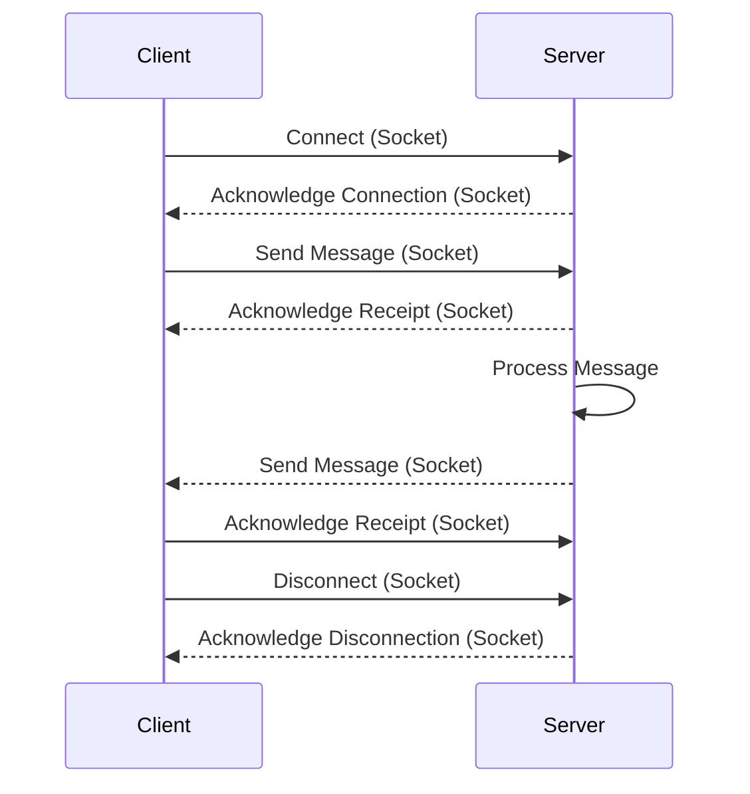

# 2    Overview

## 2.1  Service Description

FlexiChat lets you chat and have video calls on your own server.

Chats and calls take place in conversations. You can create any number of conversations. There are two kinds of conversations:

1. **One-on-one conversations.** This is where you have a private chat or call with another Talk user. You can’t add other people to this conversation or share it with a link. You start a direct one-on-one chat by looking for another user in the search bar and then clicking their name.
    
2. **Group conversations.** Besides the person who created the conversation, a group conversation can have any number of people in it. A group conversation can be shared publicly with a link, so external guest users can join a call. It can also be listed, so other people on your chat server can join the conversation.

>[!tip] 
> FlexiChat makes it possible to create ‘bridges’ between Talk conversations and conversations on other chat services like MS Teams, Discord, Matrix and others. You can find a list of supported protocols  
## 2.2 Data Model

## 2.3 Reporting

## 2.4 Technology

## 2.5 Development Tools

### Front-end

1. Templates
	- Including templates
	- Including CSS and JavaScript
	- Including images
1. JavaScript
	- Sending the CSRF token
	- Generating URLs
	- Extending core parts
	- Loading initial state
	- Keyboard shortcuts
2. CSS
3. Translation
	- PHP
	- Templates
	- JavaScript
	- Important notes
	- Adding translations
1. Theming support
	- CSS classes
	- JavaScript
	- Icons

### Back-end

|         | Môi trường                     | NodeJS |
| ------- | ------------------------------ | ------ |
| Server  | ExpressJS                      |        |
| DB      | Firebase                       |        |
| Chat    | [Socket.io](http://socket.io/) |        |
| Routing | Router                         |        |

## 2.6 Interfaces and services

1. Foundations
	- Color
	- Typography
	- Icons
	- Naming
	- Wording
2. Layout
	- Navigation → Content → Sidebar
	- Navigation → List → Content
3. Layout components
	- Navigation
	- List item
	- Content
	- Sidebar
4. Atomic components
	- Buttons
	- Action menu
	- Input fields
	- Pickers
	- Tags
	- Modal
	- Avatar
	- Progress bars and meters
	- User bubbles
	- Counter bubbles
	- Empty content
	- Skeleton screens
## 2.7 Access, Authentication and Authorisation

## 2.8 Delivery

### FlexiChat

- **iOS** 15.0+
    
- **Android** 6.0+
    
>[!note]
>You should update the FlexiChat app to the newest version.

## Web browser

For the best experience with the FlexiChat web interface, we recommend that you use the latest and supported version of a browser from this list, or one based on those:

- Microsoft **Edge**
    
- Mozilla **Firefox**
    
- Google **Chrome**/Chromium
    
- Apple **Safari**